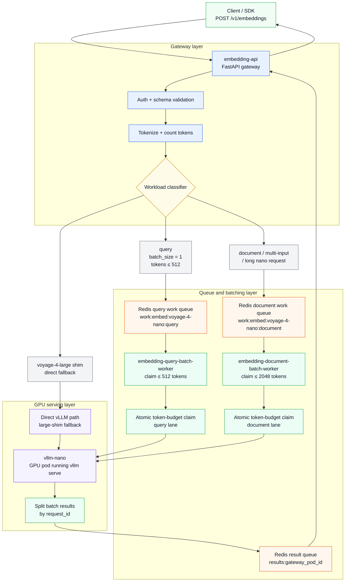
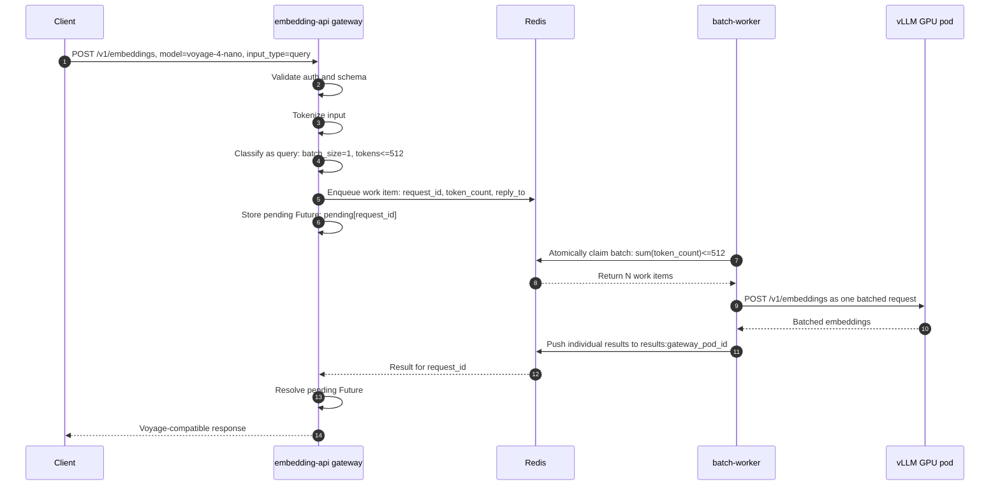
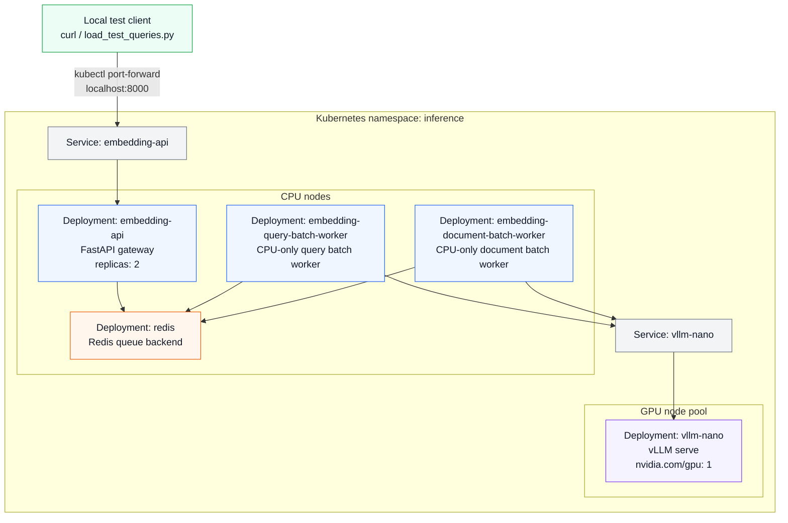

# Voyage AI-Compatible Embedding Gateway — Phase 3C

This repo is a self-hosted, Voyage AI-compatible embedding service prototype.

It exposes a Voyage AI-compatible embeddings endpoint:

```http
POST /v1/embeddings
Authorization: Bearer <local-api-key>
Content-Type: application/json
```

The gateway accepts Voyage AI-style embedding requests, validates and normalizes them, applies query/document prompt handling, counts tokens, and routes them to the appropriate internal serving path.

For short query requests, Phase 3A uses Redis-backed token-count batching before calling vLLM. Phase 3B adds a separate synchronous document/indexing lane: document, multi-input, and longer nano-model requests are decomposed into child work items, batched by token budget, and reassembled into ordered Voyage AI-compatible responses. Phase 3C adds Prometheus metrics, queue inspection, and advisory autoscaling signals based on token backlog. The `voyage-4-large` shim still falls back to the direct vLLM path.

## Phase 3C scope

Implemented in this overlay:

- `POST /v1/embeddings`
- Bearer auth
- Pydantic request validation
- `input` normalization: string or list of strings
- `input_type`: `null`, `query`, or `document`
- Voyage-style prompt prefixing for `query` and `document`
- Token counting at the gateway using the `voyageai/voyage-4-nano` tokenizer
- Logical model routing:
  - `voyage-4-nano`
  - `voyage-4-large`
- Both logical models route to backend model `voyageai/voyage-4-nano` (as `voyage-4-large` is proprietary, while `voyageai/voyage-4-nano` is an open-weight model).
- Internal vLLM call
- Voyage-compatible response shaping
- Redis-backed token-count batching for short query embedding requests
- Separate Redis-backed synchronous document/indexing lane
- Multi-input decomposition into child work items
- Ordered response reassembly for document and multi-input requests
- CPU-only batch workers that claim token-budgeted microbatches and call vLLM once per batch
- Per-gateway result queues for synchronous HTTP response handoff
- Prometheus `/metrics` endpoint
- `/debug/queues` queue introspection endpoint
- `/debug/autoscaling` advisory autoscaling endpoint
- Queue token backlog, oldest-item age, worker batch, and gateway latency metrics

Deferred:

- KEDA autoscaling from queue token metrics
- KServe
- Reranking
- Large-request unbatching/fanout
- Batch jobs with 12-hour completion window
- Contextualized embeddings
- Multimodal embeddings
- Runtime-level CUDA graph / kernel fusion experiments

## Architecture

This project implements a Voyage AI-compatible embedding gateway backed by vLLM. Phase 3A added Redis-based token-count batching for short, latency-sensitive query embedding requests. Phase 3B adds a separate synchronous document/indexing lane with a larger token budget and ordered response reassembly. Phase 3C adds observability and advisory autoscaling signals for both lanes.



### Phase 3A request flow



### Kubernetes deployment shape




### Batching policy

Phase 3A batches short query embedding requests:

```text
Batchable query:
  model = voyage-4-nano
  input_type = query
  number of inputs = 1
  token_count <= 512

Phase 3B document/indexing lane:
  model = voyage-4-nano
  input_type = document, or multi-input request, or token_count > 512
  total child batch target <= 2048 tokens

Still not batched yet:
  voyage-4-large shim requests
  reranking requests
  async /v1/batches jobs
```

The query batch worker pulls queued query requests from Redis and forms a microbatch whose total token count is capped at `QUERY_BATCH_TARGET_TOKENS=512`. The document batch worker uses a separate queue and a larger default target, `DOCUMENT_BATCH_TARGET_TOKENS=2048`.

Both lanes keep the synchronous API behavior while reducing the number of vLLM calls under concurrent traffic. Query batching protects low latency; document batching improves throughput while still using a bounded wait because `/v1/embeddings` remains synchronous.

### Phase 3C observability and autoscaling readiness

Phase 3C adds metrics and debug endpoints that make the query and document lanes measurable. The goal is to expose the signals a production autoscaler would need before actually wiring KEDA/HPA in Phase 3D.

```http
GET /metrics
GET /debug/queues
GET /debug/autoscaling
```

Important Prometheus metrics include:

```text
voyage_queue_items{model,workload}
voyage_queue_token_backlog{model,workload}
voyage_queue_oldest_item_age_seconds{model,workload}
voyage_worker_batch_size{model,workload}
voyage_worker_batch_tokens{model,workload}
voyage_worker_vllm_latency_seconds{model,workload}
voyage_gateway_request_latency_seconds{model,input_type,path}
voyage_autoscaling_recommended_replicas{model,workload}
```

The key autoscaling idea is to think in tokens rather than messages:

```text
estimated_drain_time_seconds = token_backlog / total_tokens_per_second
recommended_replicas = ceil(token_backlog / (target_drain_time_seconds * tokens_per_second_per_replica))
```

For Phase 3C this recommendation is advisory only. Phase 3D can connect the Prometheus metrics to KEDA, HPA, and GKE node pool autoscaling.

### Validated Phase 3A behavior

Example validation run:

```text
50 concurrent short query requests
→ 7 vLLM embedding calls
→ max observed batch_size = 19
→ max observed batch_tokens = 238
→ all batch_tokens <= 512
```

This confirms that the gateway no longer forwards every short query directly to vLLM. Instead, requests are routed through Redis, grouped by the batch worker, sent to vLLM as token-budgeted microbatches, and split back into individual client responses.

## Environment variables

```bash
LOCAL_API_KEYS='["local-dev-key"]'
VOYAGE_TOKENIZER_MODEL=voyageai/voyage-4-nano

VLLM_NANO_EMBEDDINGS_URL=http://vllm-nano:8000/v1/embeddings
VLLM_LARGE_SHIM_EMBEDDINGS_URL=http://vllm-large-shim:8000/v1/embeddings

# Optional, if your internal vLLM server requires auth.
VLLM_API_KEY=

REQUEST_TIMEOUT_SECONDS=60
MODEL_CONTEXT_TOKENS=32000
MAX_INPUTS=1000

# Phase 3 batching.
REDIS_URL=redis://redis:6379/0
REDIS_KEY_PREFIX=voyage-replica
ENABLE_QUERY_BATCHING=true
QUERY_MAX_TOKENS=512
QUERY_BATCH_TARGET_TOKENS=512
QUERY_MAX_WAIT_MS=10
QUERY_BATCH_MAX_ITEMS=128
ENABLE_DOCUMENT_BATCHING=true
DOCUMENT_BATCH_TARGET_TOKENS=2048
DOCUMENT_MAX_WAIT_MS=50
DOCUMENT_BATCH_MAX_ITEMS=128

# Phase 3C observability/autoscaling-readiness.
QUEUE_INSPECTION_MODEL=voyage-4-nano
QUEUE_INSPECTION_MAX_ITEMS=10000
QUERY_TOKENS_PER_SECOND_PER_REPLICA=8000
DOCUMENT_TOKENS_PER_SECOND_PER_REPLICA=8000
QUERY_TARGET_DRAIN_TIME_SECONDS=0.5
DOCUMENT_TARGET_DRAIN_TIME_SECONDS=2.0
QUERY_AUTOSCALE_MIN_REPLICAS=1
QUERY_AUTOSCALE_MAX_REPLICAS=4
DOCUMENT_AUTOSCALE_MIN_REPLICAS=1
DOCUMENT_AUTOSCALE_MAX_REPLICAS=8
QUERY_CURRENT_REPLICAS=1
DOCUMENT_CURRENT_REPLICAS=1
GATEWAY_INSTANCE_ID=local-gateway
RESULT_QUEUE_TTL_SECONDS=120
BATCH_WORKER_MODEL=voyage-4-nano
BATCH_WORKER_WORKLOAD=query
```

## Run gateway locally

```bash
python -m venv .venv
source .venv/bin/activate
pip install -e ".[dev]"

export LOCAL_API_KEYS='["local-dev-key"]'
export VLLM_NANO_EMBEDDINGS_URL=http://localhost:8001/v1/embeddings
export VLLM_LARGE_SHIM_EMBEDDINGS_URL=http://localhost:8001/v1/embeddings
export REDIS_URL=redis://localhost:6379/0
export ENABLE_QUERY_BATCHING=false

uvicorn app.main:app --host 0.0.0.0 --port 8000 --reload
```

To test Phase 3 batching locally, run Redis and one or more batch workers in separate terminals:

```bash
docker run --rm -p 6379:6379 redis:7-alpine
```

```bash
export LOCAL_API_KEYS='["local-dev-key"]'
export REDIS_URL=redis://localhost:6379/0
export ENABLE_QUERY_BATCHING=true
export VLLM_NANO_EMBEDDINGS_URL=http://localhost:8001/v1/embeddings
python -m app.batch_worker
```

For the document lane, start a second worker with:

```bash
export BATCH_WORKER_WORKLOAD=document
export ENABLE_DOCUMENT_BATCHING=true
export DOCUMENT_BATCH_TARGET_TOKENS=2048
export DOCUMENT_MAX_WAIT_MS=50
python -m app.batch_worker
```

Then run the gateway with `ENABLE_QUERY_BATCHING=true` and `ENABLE_DOCUMENT_BATCHING=true`.

## Example request

```bash
curl --request POST \
  --url http://localhost:8000/v1/embeddings \
  --header "Authorization: Bearer local-dev-key" \
  --header "content-type: application/json" \
  --data '{
    "input": "hello world",
    "model": "voyage-4-nano",
    "input_type": "query"
  }'
```

## Load-test query batching

After port-forwarding or running locally:

```bash
python scripts/load_test_queries.py --requests 20 --concurrency 20

python scripts/load_test_documents.py \
  --requests 30 \
  --concurrency 10 \
  --inputs-per-request 4
```

Check batch-worker logs for lines like:

```text
claimed_query_batch batch_size=... batch_tokens=... target_tokens=512
completed_query_batch batch_size=... batch_tokens=...
claimed_document_batch batch_size=... batch_tokens=... target_tokens=2048
completed_document_batch batch_size=... batch_tokens=...
```

For 20 concurrent short query requests, you should see fewer vLLM calls than client requests.

## Example internal vLLM worker

For the real GKE version, the vLLM runtime still runs as a separate GPU Deployment.

```bash
vllm serve voyageai/voyage-4-nano \
  --runner pooling \
  --convert embed \
  --hf-overrides '{"architectures":["VoyageQwen3BidirectionalEmbedModel"]}' \
  --trust-remote-code \
  --dtype bfloat16 \
  --max-model-len 32768 \
  --gpu-memory-utilization 0.5 \
  --enforce-eager \
  --host 0.0.0.0 \
  --port 8000 \
  --served-model-name voyageai/voyage-4-nano
```

The gateway or batch-worker then calls:

```text
http://vllm-nano:8000/v1/embeddings
http://vllm-large-shim:8000/v1/embeddings
```

## Kubernetes notes

Phase 3B adds:

```text
redis Deployment/Service
embedding-query-batch-worker Deployment
embedding-document-batch-worker Deployment
GATEWAY_INSTANCE_ID from pod metadata.name
ENABLE_QUERY_BATCHING=true
ENABLE_DOCUMENT_BATCHING=true
```

Build and push the Phase 3 app image:

```bash
export IMAGE=us-central1-docker.pkg.dev/voyage-replica-dev/voyage-replica/embedding-api:phase3-amd64

docker buildx build \
  --platform linux/amd64 \
  -t "$IMAGE" \
  --push .
```

Apply:

```bash
kubectl apply -k k8s/base
kubectl -n inference rollout status deployment/embedding-api
kubectl -n inference rollout status deployment/embedding-query-batch-worker
```

Validate via port-forward:

```bash
kubectl -n inference port-forward svc/embedding-api 8000:80
```

## Notes

This gateway intentionally tokenizes both logical models with `voyageai/voyage-4-nano`.

That is because this project has only one real backend model. The logical `voyage-4-large` route is a platform shim for studying model routing and model-specific scaling boundaries, not a claim that the backend model is actually `voyage-4-large`.
