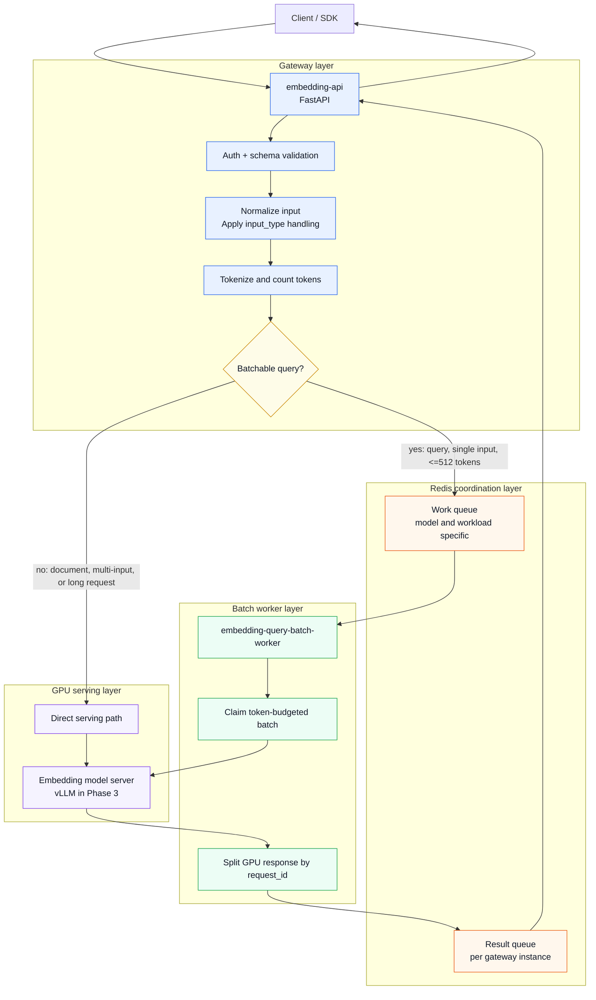
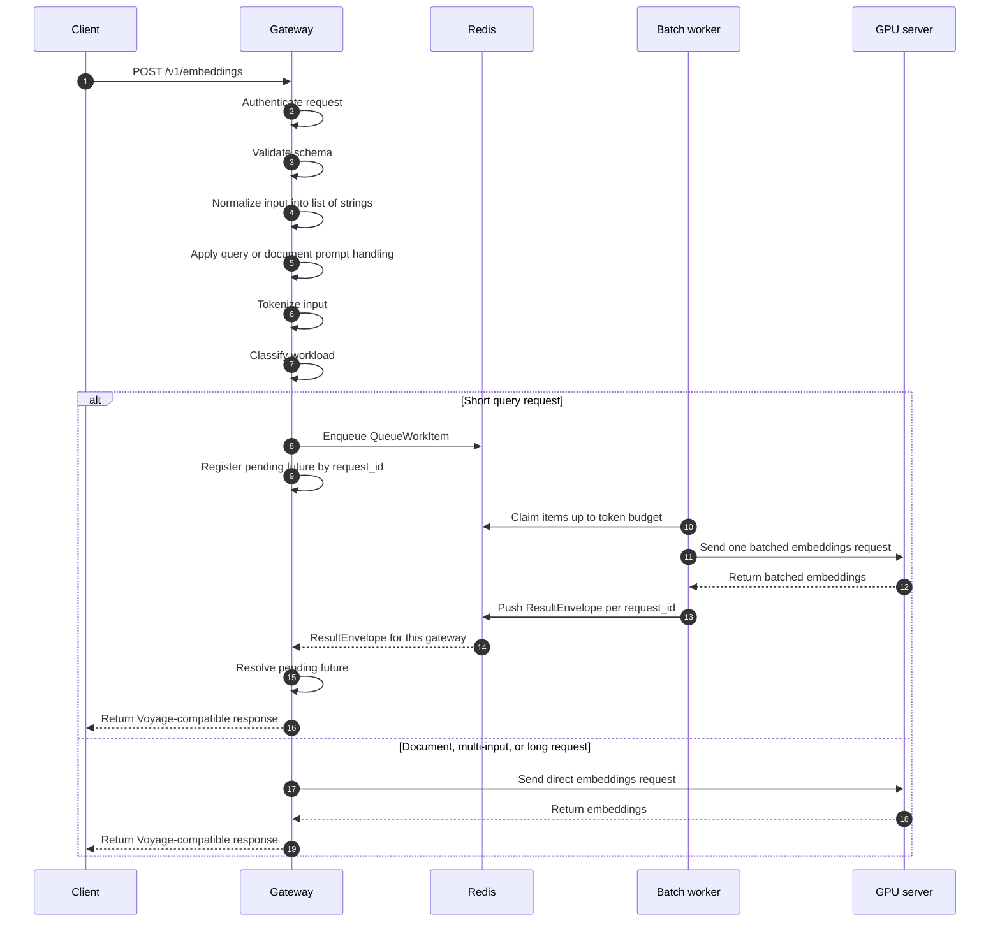
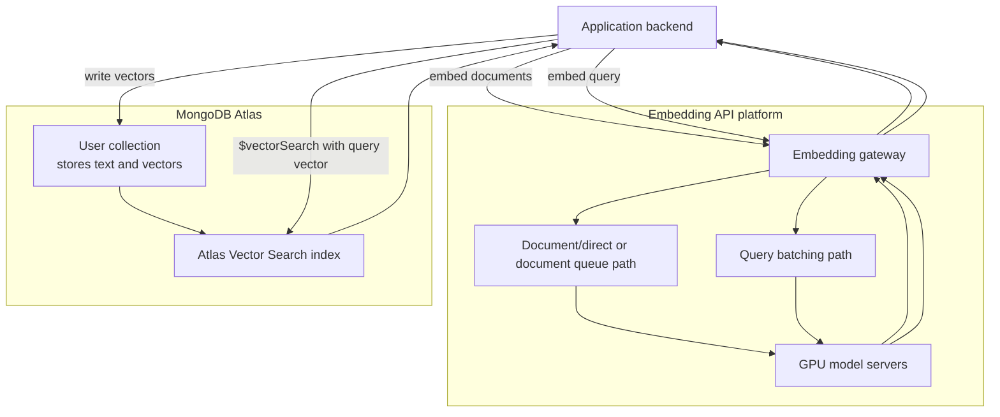
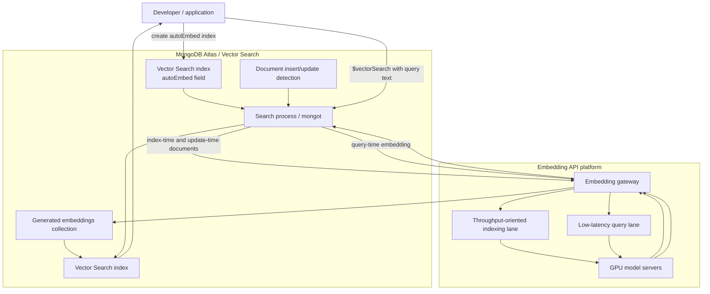
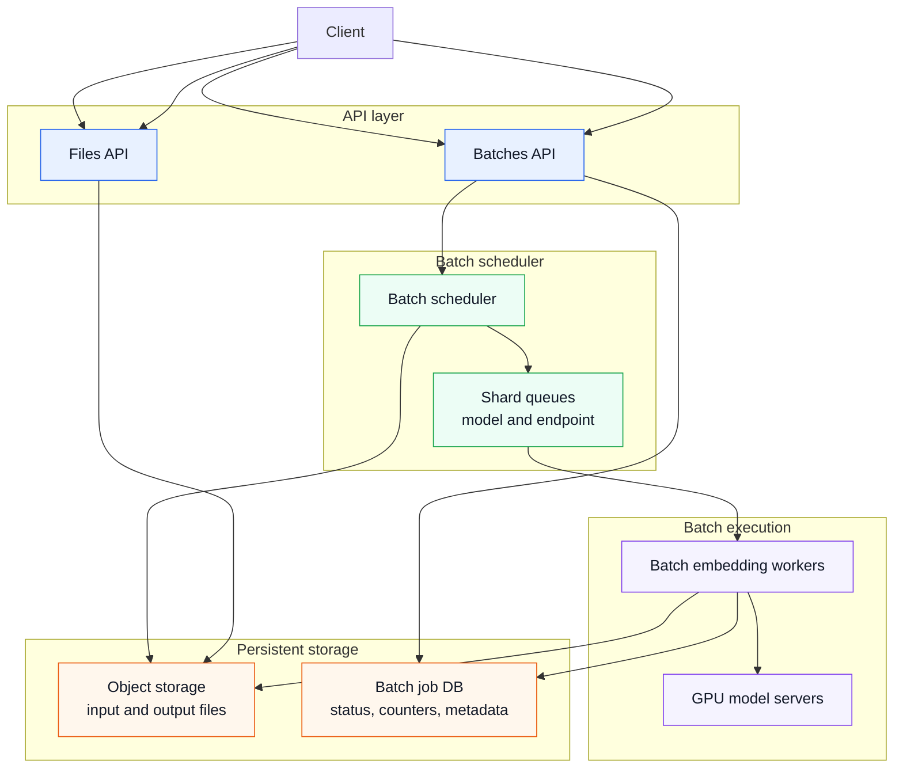

# System Design: Voyage-Compatible Embedding Gateway

This document describes the system design behind the current Phase 3 implementation of the Voyage-compatible embedding gateway.

The current system focuses on **synchronous embedding requests**:

```http
POST /v1/embeddings
Authorization: Bearer <local-api-key>
Content-Type: application/json
```

The design intentionally starts with a working end-to-end system, then adds the first important production-style optimization: **Redis-backed token-count batching for short query requests**.

Future work will extend this design to support asynchronous batch-style APIs, MongoDB Atlas integration, tenant-aware rate limiting, billing, and stronger production fault tolerance.

---

## 1. Problem Statement

Design a self-hosted, Voyage-compatible embedding inference platform.

Clients should be able to send embedding requests to a public-facing gateway and receive Voyage-shaped embedding responses. Internally, the platform should route requests to GPU-backed model-serving workers while maintaining low latency for interactive query traffic and improving GPU utilization under concurrent load.

This prototype is not trying to fully replicate Voyage AI or MongoDB Atlas production. It is a focused learning project for the core inference-serving path:

```text
Client request
  -> API gateway
  -> request validation and token counting
  -> workload classification
  -> direct or batched serving path
  -> GPU embedding worker
  -> Voyage-compatible response
```

The current implementation uses:

```text
FastAPI gateway
Redis work queue
Redis result queues
CPU-only batch worker
vLLM embedding worker
Kubernetes deployment manifests
```

---

## 2. Functional Requirements

### Required in current Phase 3

Clients should be able to:

1. Call a Voyage-compatible `POST /v1/embeddings` endpoint.
2. Authenticate using a bearer token.
3. Send `input` as either a single string or a list of strings.
4. Specify a logical model:
   - `voyage-4-nano`
   - `voyage-4-large`
5. Specify `input_type`:
   - `query`
   - `document`
   - omitted / null
6. Receive a Voyage-compatible embedding response.
7. Send short query requests that are batched internally before hitting the GPU worker.
8. Send document, multi-input, or long requests that still complete synchronously through a direct GPU-serving path.

### Deferred for later phases

Clients should eventually be able to:

1. Submit asynchronous batch jobs.
2. Upload `.jsonl` input files for batch processing.
3. Poll batch job status.
4. Retrieve batch output files.
5. Use contextualized embeddings.
6. Use reranking endpoints.
7. Use multiple real model backends, not just a single nano backend plus logical aliases.
8. Use tenant-aware API keys, quotas, rate limits, and billing.
9. Use the service through MongoDB Atlas integration modes.

---

## 3. Non-Functional Requirements

These requirements motivate the current architecture.

| Requirement | Target / Motivation | Design implication |
|---|---|---|
| Low latency for query requests | Query embeddings often sit on the interactive retrieval path. Added inference latency is user-visible. | Keep the API synchronous. Avoid slow cold paths. Use short max-wait batching. |
| High GPU utilization | Small query payloads underutilize the GPU when sent one at a time. | Batch short queries by token count before calling the GPU worker. |
| Preserve per-request semantics | Even when requests are batched internally, clients should receive one normal response per request. | Use `request_id`, `reply_to`, and per-gateway result queues. |
| Token-aware scheduling | For embeddings, request cost is closer to token count than raw request count. | Gateway tokenizes inputs and workers claim batches up to a token budget. |
| Model isolation | Different models may have different latency, cost, and scaling profiles. | Use logical model routing and model-specific queue names. |
| Horizontal scalability | Gateways and workers should be independently scalable. | Make the gateway stateless except for in-memory pending requests; use Redis for cross-process handoff. |
| Fault tolerance | Worker, Redis, or GPU failures should not silently lose customer requests. | Use explicit result envelopes, timeouts, idempotency, leases, retries, and durable job state in later phases. |
| Availability | The service should degrade predictably during backend incidents. | Decide whether to fallback to direct GPU calls, return 503, or use local in-process batching when Redis is unhealthy. |
| Cost control | GPU time is expensive, and tokens are billable units. | Track tokens by model, tenant, workload, and request path. |
| Local reproducibility | The project should be runnable from a laptop and deployable to GKE. | Use FastAPI, Redis, Kubernetes manifests, and vLLM as separate components. |

---

## 4. Core Domain Distinction: Queries vs Documents

The current design is inspired by the public Voyage / MongoDB materials that distinguish query-like traffic from document/indexing traffic.

### Query traffic

A query request is:

```text
batch size = 1
token count <= 512
latency-sensitive
often on the retrieval path
```

Example:

```text
User asks a question
  -> application embeds the query
  -> application runs vector search
  -> application optionally reranks
  -> application returns answer
```

This is the path where every millisecond can affect the user experience.

### Document traffic

A document request is any embedding request that is not a query:

```text
batch size > 1
or token count > 512
or indexing-oriented request
```

Document traffic is often used for:

```text
initial vector index builds
ongoing re-embedding
database document indexing
large corpus processing
```

It is more throughput-sensitive, but if exposed through a synchronous API, it still has an API latency SLO. In our current Phase 3 prototype, document requests use the direct vLLM path. A future phase should move them to a document queue with throughput-oriented scheduling and autoscaling.

---

## 5. Capacity Estimation

For this system, the most useful estimates are not storage estimates. The key resource is **GPU serving capacity**, and the useful unit is **tokens over time**.

Important quantities:

```text
query_request_rate      = short query requests per second
avg_query_tokens        = average tokens per query
query_token_in_rate     = query_request_rate * avg_query_tokens

worker_token_out_rate   = tokens processed per second per GPU replica
queue_backlog_tokens    = total queued tokens waiting to be served
estimated_drain_time    = queue_backlog_tokens / worker_token_out_rate
```

For Phase 3A, we use a fixed token budget:

```text
QUERY_MAX_TOKENS = 512
QUERY_BATCH_TARGET_TOKENS = 512
QUERY_MAX_WAIT_MS = 10
```

This means a batch worker tries to combine short query requests until either:

1. the token budget is reached,
2. the max item count is reached,
3. the max wait budget is reached, or
4. there is no more immediately available work.

The goal is not to maximize batch size at all costs. The goal is to increase GPU utilization without violating the latency expectations of synchronous query requests.

---

## 6. Roofline Analysis and Why Token Batching Helps

The most important performance intuition is a roofline-style analysis.

A simplified roofline model says achievable performance is bounded by:

```text
achievable_flops_per_second =
    min(peak_compute_flops_per_second, memory_bandwidth_bytes_per_second * arithmetic_intensity)
```

Where:

```text
arithmetic_intensity = useful FLOPs / bytes moved from memory
```

For very short embedding queries, the GPU often has low arithmetic intensity. The system moves model weights, activations, and intermediate tensors, but does not do enough useful math per byte transferred to fully utilize the GPU compute cores. This is the **memory-bound regime**.

In this regime:

```text
small token count
  -> low arithmetic intensity
  -> memory-bound execution
  -> latency is dominated by fixed overhead and memory movement
```

The key observation from the public Voyage/MongoDB materials is:

```text
If latency is nearly flat in the memory-bound region,
then adding more short queries into one token-budgeted batch can be almost free.
```

That means batching can improve both throughput and sometimes even per-request latency:

```text
without batching:
  many tiny requests each pay fixed overhead separately

with token-count batching:
  one GPU forward pass processes multiple tiny requests
  fixed overhead is amortized
  GPU arithmetic intensity improves
  queue drains faster
```

This is why the batching target should be expressed in **tokens**, not number of requests.

---

## 7. How to Pick the Optimal Token Batch Size

The optimal token batch size is not a universal constant. It depends on:

```text
model architecture
embedding dimension
sequence length distribution
pooling/normalization implementation
inference engine
GPU type
precision
concurrency
latency SLO
```

The correct procedure is empirical.

### Step 1: Benchmark latency vs total batch tokens

For a fixed model and GPU, run synthetic and real traffic benchmarks:

```text
batch_tokens = 16, 32, 64, 128, 256, 512, 768, 1024, ...
```

Measure:

```text
p50 latency
p95 latency
p99 latency
tokens/sec
GPU utilization
SM occupancy
memory bandwidth
MFU or effective FLOPs utilization
```

### Step 2: Find the saturation point

You are looking for the knee of the curve:

```text
before saturation:
  latency approximately flat
  throughput and MFU improve as tokens increase

after saturation:
  latency grows roughly linearly with tokens
  throughput/MFU no longer improves enough to justify added latency
```

This saturation point is where batching is most attractive.

### Step 3: Choose a target below or near the knee

The production target should be slightly conservative:

```text
target_batch_tokens <= measured_saturation_point
```

This leaves headroom for:

```text
traffic skew
tokenizer estimation error
larger-than-normal requests
multi-tenant interference
p99 latency protection
```

### Why this prototype uses 512

The public Voyage/MongoDB talk defined a query as a single example with token count less than or equal to roughly 512. The public MongoDB blog also describes a saturation point around 600 tokens for one Voyage model on A100 hardware. Our prototype uses:

```text
QUERY_BATCH_TARGET_TOKENS = 512
```

This is a reasonable learning-project value because:

1. it matches the public query/document boundary,
2. it is below the cited saturation point from the public blog,
3. it is conservative for running on smaller L4-class hardware,
4. it is easy to reason about in tests,
5. it avoids accidentally treating long document traffic as latency-sensitive query traffic.

In a real production system, this value should be re-profiled per model, per GPU, and per inference engine.

### Why our validation did not reach 512 tokens

In one Phase 3A validation run:

```text
50 concurrent short query requests
-> 7 vLLM embedding calls
-> max observed batch_size = 19
-> max observed batch_tokens = 238
-> all batch_tokens <= 512
```

This does not mean the target was wrong. It means the load-test queries were very short and concurrency was limited. If each query is roughly 12 tokens and concurrency is 20, the largest possible batch from immediately available work is around:

```text
20 * 12 = 240 tokens
```

So seeing a max around 238 tokens is consistent with the test shape.

---

## 8. Core Entities

### EmbeddingRequest

Represents the client-facing request.

Relevant fields:

```text
input: string | list[string]
model: string
input_type: query | document | null
output_dimension: currently rejected in Phase 3
```

### NormalizedEmbeddingRequest

Internal representation after validation and normalization.

Relevant fields:

```text
inputs: list[string]
logical_model: voyage-4-nano | voyage-4-large
backend_model: voyageai/voyage-4-nano
input_type: query | document | null
```

### WorkloadClassification

Determines whether a request should use the query batching path.

Relevant fields:

```text
workload_type: query | direct
token_count: int
is_batchable: bool
reason: string
```

### QueueWorkItem

Redis-serialized unit of work consumed by the batch worker.

Relevant fields:

```text
request_id: string
model: string
input: string
input_type: query
token_count: int
reply_to: gateway instance id
created_at_ms: int
tenant_id: future
api_key_id: future
```

### Batch

A group of compatible `QueueWorkItem`s claimed by a worker.

Relevant fields:

```text
items: list[QueueWorkItem]
total_tokens: int
target_tokens: int
model: string
workload: query
```

### ResultEnvelope

Redis-serialized response sent back to the gateway that owns the HTTP request.

Relevant fields:

```text
request_id: string
ok: bool
embedding: list[float] | null
error: string | null
usage: token usage metadata
```

### Future TenantUsageRecord

Needed for billing and quota enforcement.

Relevant fields:

```text
tenant_id
api_key_id
model
input_type
request_count
input_tokens
output_vectors
status
created_at
latency_ms
```

---

## 9. API Design

### Current synchronous embeddings API

```http
POST /v1/embeddings
Authorization: Bearer <local-api-key>
Content-Type: application/json
```

Example request:

```json
{
  "input": "mongodb atlas vector search",
  "model": "voyage-4-nano",
  "input_type": "query"
}
```

Example response shape:

```json
{
  "object": "list",
  "data": [
    {
      "object": "embedding",
      "embedding": [0.0123, -0.0456],
      "index": 0
    }
  ],
  "model": "voyage-4-nano",
  "usage": {
    "total_tokens": 12
  }
}
```

### Why REST?

The public API is request/response-oriented and should be easy to call from SDKs, curl, and application backends. REST over HTTP is sufficient for the client-facing API.

Internally, the gateway and workers also use HTTP to call vLLM because vLLM already exposes an OpenAI-style embeddings endpoint.

---

## 10. High-Level Design



---

## 11. Synchronous Query Request Flow



---

## 12. Current Batching Policy

Phase 3A batches only this case:

```text
model = voyage-4-nano
input_type = query
number of inputs = 1
token_count <= 512
```

These requests are not batched yet:

```text
document requests
multi-input requests
long requests over 512 tokens
voyage-4-large shim requests
reranking requests
```

The main reason is focus. Short queries are the cleanest path to demonstrate token-count batching because they are latency-sensitive, small, and easy to combine without changing the client-facing API.

---

## 13. Why Redis?

Redis is used as a lightweight coordination layer between stateless gateway pods and independently scalable batch workers.

The current Redis responsibilities are:

1. Store pending query work items.
2. Allow workers to atomically claim a token-budgeted batch.
3. Store per-gateway result queues.
4. Provide a simple local-development story.

Redis is a good fit for Phase 3A because the queue semantics are custom:

```text
claim the oldest compatible items until sum(token_count) <= target_tokens
```

A generic FIFO queue is not enough because the worker needs to make a token-budgeted batch, not just pop N messages.

### Why not Kafka or RabbitMQ for Phase 3A?

Kafka and RabbitMQ are excellent systems, but their default batching semantics are not exactly what this scheduler needs.

A normal broker thinks in terms of:

```text
message count
bytes
partitions
consumer offsets
prefetch counts
```

The embedding scheduler thinks in terms of:

```text
model
workload
token_count
oldest request age
target batch tokens
tail latency budget
```

The worker needs to inspect multiple queued items and atomically claim a subset whose total token count fits the target. Redis plus a Lua script gives a simple way to implement this in one atomic operation.

A production design could still use Kafka for durable ingestion and Redis for hot scheduling:

```text
Kafka:
  durable event log
  replay
  audit
  cross-region replication

Redis:
  hot token-aware scheduling
  short-lived queues
  low-latency atomic claim
```

---

## 14. Fault Tolerance and Availability

The current implementation demonstrates the design shape, but it is not fully production-durable. A production version should explicitly handle failures at every hop.

### Gateway dies while request is pending

Current prototype behavior:

```text
client HTTP connection is lost
worker may still finish
late result eventually expires in Redis
client retries
```

Production improvement:

```text
support idempotency keys
persist request state for retryable operations
return deterministic response for duplicate request_id
expire orphaned results safely
```

### Batch worker dies after claiming work

Current prototype behavior is limited.

Production improvement:

```text
claim work with a lease
write claimed items to an in-flight set
ack only after results are pushed
reclaim expired leases
make result writes idempotent by request_id
```

Redis Streams with consumer groups, a custom visibility-timeout queue, or a durable job table can all support this pattern.

### GPU server times out or returns an error

The batch worker should return an error envelope for each affected request:

```text
ok = false
error = backend_timeout
request_id = original request id
```

The gateway maps the error envelope to an appropriate HTTP error.

### Redis unavailable

Possible behaviors:

1. **Fail closed**: return 503 for batchable queries.
2. **Bypass batching**: call the GPU server directly.
3. **Degraded local batching**: use per-gateway in-process batching until Redis recovers.

The right choice depends on product priorities. For an interactive embedding API, bypassing batching may preserve availability but increase GPU cost and reduce global throughput. For strict cost control, failing closed may be safer.

### Redis high availability

Production Redis should not be a single pod.

Options:

```text
managed Redis with multi-AZ failover
Redis Sentinel
Redis Cluster
AOF persistence
replica promotion
regular failover tests
```

Even with HA Redis, the design should assume short interruptions are possible and define a clear degraded mode.

### Multi-region availability

For a global production service:

```text
route tenants to regional inference pools
keep model queues regional
avoid cross-region synchronous queue hops
replicate control-plane metadata
keep per-region capacity buffers
```

The data plane should avoid making a query request wait on a remote region unless the local region is unavailable and the product accepts higher latency.

---

## 15. Scaling Strategy

### Gateway scaling

The gateway is CPU-bound and mostly stateless.

Scale based on:

```text
HTTP request rate
CPU utilization
event-loop latency
pending request count
tokenization latency
```

### Batch worker scaling

Batch workers are CPU-side schedulers.

Scale based on:

```text
queue backlog tokens
oldest queued request age
claim loop utilization
worker CPU utilization
```

### GPU server scaling

GPU workers are the expensive bottleneck.

Scale based on:

```text
tokens per second
GPU utilization
GPU memory utilization
queue backlog tokens
estimated drain time
p95 / p99 latency
```

### Future autoscaling direction

A production version should use per-model queues and token-based autoscaling:

```text
required_replicas =
    ceil(predicted_token_in_rate / measured_token_out_rate_per_replica)
```

It should also account for cold-start latency. If new GPU pods take minutes to become ready, the autoscaler needs either warm capacity or model-weight caching close to the GPU.

---

## 16. Observability

The system should expose metrics at each layer.

### Gateway metrics

```text
http_requests_total
http_request_duration_ms
auth_failures_total
validation_failures_total
requests_by_model
requests_by_input_type
token_count_histogram
batchable_requests_total
direct_requests_total
pending_futures
```

### Redis / queue metrics

```text
work_queue_length
work_queue_token_backlog
oldest_work_item_age_ms
result_queue_length
expired_results_total
inflight_items
reclaimed_items_total
```

### Batch worker metrics

```text
claimed_batches_total
claimed_batch_size_histogram
claimed_batch_tokens_histogram
batch_claim_duration_ms
vllm_call_duration_ms
completed_batches_total
failed_batches_total
```

### GPU / inference-engine metrics

```text
gpu_utilization
gpu_memory_used
gpu_memory_bandwidth
sm_occupancy
model_tokens_per_second
model_errors_total
model_load_time_seconds
pooling_latency_ms
normalization_latency_ms
serialization_latency_ms
tokenization_latency_ms
```

### End-to-end SLO metrics

```text
p50 / p95 / p99 request latency
error rate
timeout rate
queue wait time
GPU execution time
overhead time = total latency - GPU execution time
cost per million tokens
```

---

## 17. What We Skipped So Far

The current project intentionally skips several production concerns.

### Billing

Skipped:

```text
tenant usage ledger
token accounting by model
per-project invoices
free-tier credits
discounting for batch API
refund or partial charge handling
```

Needed later:

```text
write immutable usage records
separate accepted tokens from failed tokens
track sync vs batch pricing
expose usage dashboard
integrate with Atlas billing if using MongoDB account-level billing
```

### Rate limiting and quotas

Skipped:

```text
requests per minute
tokens per minute
concurrent request caps
batch job caps
tenant priority tiers
abuse protection
```

Needed later:

```text
API-key-derived tenant identity
RPM and TPM token buckets
separate query and indexing limits
per-model quotas
queue admission control
429 responses with retry-after
```

### MongoDB Atlas integration

Skipped:

```text
Atlas account identity
Atlas project mapping
Model API Key management
Vector Search index integration
autoEmbed integration
mongot integration
Atlas billing integration
```

Needed later:

```text
control plane APIs
tenant/project auth
index-time document embedding path
query-time embedding path
usage metering
rate limit configuration
separate keys or quota pools for query and indexing
```

### Security and compliance

Skipped:

```text
real secret management
mTLS between services
PII-aware logging
audit logs
data retention policy
regional data residency
```

### Production runtime optimization

Skipped:

```text
custom embedding engine
multi-replica per GPU
sequence packing
kernel fusion
CUDA graphs
parallel tokenization
vectorized serialization
engine-level pooling optimizations
```

---

## 18. MongoDB Atlas Integration Sketch

There are two useful integration modes to design for.

---

### Mode 1: Standard API mode

In standard mode, the application owns the embedding pipeline.

#### Write/indexing flow

```text
Application
  -> calls embedding API with documents
  -> receives vectors
  -> writes vectors into MongoDB documents
  -> creates or updates Atlas Vector Search index
```

#### Query flow

```text
Application
  -> calls embedding API with user query
  -> receives query vector
  -> sends MongoDB $vectorSearch query using query vector
  -> receives matching documents
```

#### Architecture sketch



#### Pros

```text
works with any vector database
application has explicit control
simple to reason about
easy to prototype
```

#### Cons

```text
application must manage embedding pipelines
risk of stale embeddings
risk of query/document model mismatch
application handles retries and rate limits
```

---

### Mode 2: Automated embedding mode

In automated embedding mode, MongoDB Vector Search owns embedding generation.

The user configures an index with an `autoEmbed` field. Atlas / Vector Search then generates embeddings:

```text
at index time for the configured document field
at insert/update time as documents change
at query time for natural language query text
```

#### Index-time flow

```text
User creates Vector Search index with autoEmbed
  -> Atlas scans existing documents
  -> document text is sent to embedding service
  -> generated embeddings are stored in internal generated-embeddings collection
  -> Vector Search index is built over generated embeddings
```

#### Update-time flow

```text
User inserts or updates document
  -> Atlas detects changed indexed text field
  -> embedding job is scheduled asynchronously
  -> embedding service generates new vector
  -> generated embedding is updated
  -> Vector Search index catches up
```

#### Query-time flow

```text
User sends $vectorSearch query with natural language text
  -> Atlas embeds query text using compatible model
  -> Atlas runs vector search
  -> Atlas returns matching documents
```

#### Architecture sketch



#### Pros

```text
developer does not manage vectors
less risk of stale embeddings
query model and index model compatibility can be enforced
Atlas can own retries, index build progress, and re-embedding
```

#### Cons

```text
requires deeper Atlas integration
requires billing and quota integration
requires separate SLOs for indexing vs query
requires careful isolation so index builds do not starve live queries
```

### Implication for our serving platform

Automated embedding mode requires two separate lanes:

```text
query lane:
  synchronous
  low latency
  small token-count batching
  strict p99

indexing lane:
  asynchronous or semi-synchronous
  throughput-oriented
  larger batches
  stronger retry semantics
  progress tracking
```

This maps naturally to our current direction:

```text
Phase 3A:
  query lane with Redis token-count batching

Future:
  document/indexing lane with durable queues, autoscaling, and job state
```

---

## 19. Future Extension: Asynchronous Batch API

The current system handles synchronous requests. The next major extension is a batch API.

### Why batch API?

Synchronous APIs are good for interactive use cases:

```text
user query -> embed query -> vector search -> return answer
```

Batch APIs are better for large offline workloads:

```text
upload many requests
process them asynchronously
retrieve outputs later
```

For batch jobs, the product contract changes:

```text
The request does not need to finish immediately.
The platform can optimize for throughput and cost.
The platform can use larger batches and longer queueing windows.
The platform must persist job state and outputs.
```

### Future functional requirements

Clients should be able to:

1. Upload a `.jsonl` file containing many embedding requests.
2. Create a batch job for a target endpoint.
3. Poll batch status.
4. Retrieve output file when the job completes.
5. Retrieve error file if some rows fail.
6. Cancel a running batch if needed.

### Future API sketch

```http
POST /v1/files
Authorization: Bearer <local-api-key>
Content-Type: multipart/form-data
```

```json
{
  "purpose": "batch",
  "file": "<jsonl file>"
}
```

```http
POST /v1/batches
Authorization: Bearer <local-api-key>
Content-Type: application/json
```

```json
{
  "input_file_id": "file_abc123",
  "endpoint": "v1/embeddings",
  "completion_window": "12h",
  "request_params": {
    "model": "voyage-4-nano",
    "input_type": "document"
  }
}
```

```http
GET /v1/batches/{batch_id}
```

```http
GET /v1/files/{output_file_id}/content
```

### Future batch architecture



### New entities for batch API

```text
FileObject
  file_id
  purpose
  size_bytes
  created_at
  storage_uri

BatchJob
  batch_id
  tenant_id
  endpoint
  input_file_id
  output_file_id
  error_file_id
  status
  total_requests
  completed_requests
  failed_requests
  created_at
  started_at
  completed_at

BatchTask
  task_id
  batch_id
  model
  endpoint
  input_offset_start
  input_offset_end
  status
  retry_count
```

### Batch job states

```text
validating
queued
running
finalizing
completed
failed
cancelled
expired
```

### Batch vs synchronous serving

| Dimension | Synchronous embeddings | Batch embeddings |
|---|---|---|
| User waits on HTTP response | Yes | No |
| Latency priority | High | Lower |
| Throughput priority | Medium to high | Very high |
| Queue wait budget | Milliseconds | Seconds/minutes acceptable |
| State persistence | Minimal | Required |
| Result storage | Response body | Output file |
| Retry model | Client retry | Platform-managed retry |
| Scheduling | Protect p99 latency | Maximize GPU efficiency |

---

## 20. Challenging the vLLM Choice

The current repo uses vLLM because it is practical for a prototype:

```text
open-source
easy to run on Kubernetes
OpenAI-compatible HTTP API
supports pooling / embedding runner
works with the open-weight voyage-4-nano model
good learning surface for model-serving infrastructure
```

But vLLM should not be assumed to be the final production engine for embeddings.

### Why vLLM may be suboptimal for embeddings

vLLM was originally famous for generative LLM serving, especially efficient KV-cache management and continuous batching for decoding workloads. Embedding inference is different:

```text
no autoregressive decode loop
no long-lived KV cache
one forward pass plus pooling / normalization
often short sequences
often dominated by tokenization, serialization, pooling, memory movement, and fixed overhead
```

For embedding workloads, the bottleneck may be outside the part of vLLM that is most optimized.

### Snowflake's public results

Snowflake publicly reported that plain vLLM left GPUs underutilized for embedding workloads. Their optimizations focused on:

```text
faster serialization
disaggregated / parallel tokenization
multi-replica execution on one GPU
better GPU utilization
```

They reported large throughput improvements over plain vLLM and also compared against Hugging Face Text Embeddings Inference (TEI). Their Arctic Inference project is positioned as an optimized vLLM plugin rather than a totally unrelated serving stack, but the lesson still applies:

```text
vLLM is convenient, but plain vLLM may not be the fastest embedding engine.
```

### Alternatives to evaluate

A production platform should benchmark:

```text
plain vLLM pooling runner
vLLM + Arctic Inference style optimizations
Hugging Face Text Embeddings Inference
TensorRT / TensorRT-LLM path
ONNX Runtime / custom Triton kernels
custom in-house embedding engine
```

The benchmark should compare:

```text
p50 / p95 / p99 latency
tokens per second per GPU
requests per second per GPU
cost per million tokens
serialization overhead
tokenization overhead
pooling and normalization overhead
cold-start time
multi-tenant isolation behavior
operational complexity
```

### Decision stance for this repo

For this repo, vLLM is the right choice because the project goal is platform design, not kernel-level optimization.

For production, the serving engine should be treated as replaceable:

```text
Gateway API should not depend on vLLM-specific response details.
Worker interface should be engine-agnostic.
Batching policy should be benchmark-driven.
Engine choice should be based on measured latency, throughput, and cost.
```

This keeps the architecture honest: vLLM is a reasonable starting point, not a permanent assumption.

---

## 21. Deep Dives

### Deep Dive 1: Latency vs Throughput

The core tradeoff is:

```text
larger batches -> better GPU utilization
larger batches -> more queue wait time
```

For synchronous query requests, the system should prefer bounded waiting:

```text
QUERY_MAX_WAIT_MS = 10
```

This intentionally leaves some GPU efficiency on the table to protect tail latency.

For asynchronous batch jobs, the tradeoff changes. The system can wait longer to build larger batches because the user is no longer waiting on a single HTTP request.

### Deep Dive 2: Token Budget vs Request Count

Request-count batching is simpler, but token-count batching is safer.

Bad request-count batch:

```text
128 requests * 512 tokens/request = 65,536 tokens
```

This can blow up latency or memory.

Token-count batch:

```text
sum(tokens) <= 512
```

This gives the worker a predictable upper bound.

### Deep Dive 3: Multi-Model Routing

The current repo exposes two logical models:

```text
voyage-4-nano
voyage-4-large
```

Both route to the same backend model in this prototype:

```text
voyageai/voyage-4-nano
```

This is intentional. It allows the platform layer to practice model routing and model-specific configuration without needing multiple real GPU models.

A production design would isolate by:

```text
model
model version
hardware profile
SLO tier
tenant priority
```

### Deep Dive 4: Tenant Isolation

The current project has a local bearer-token auth model.

A production design should add:

```text
tenant_id derived from API key
per-tenant request quotas
per-tenant token quotas
fair scheduling
abuse detection
billing counters
```

Without this, a single tenant could flood the Redis queue and increase latency for everyone else.

### Deep Dive 5: Query lane vs indexing lane

Query and indexing traffic should not share one undifferentiated queue.

Recommended separation:

```text
query lane:
  low latency
  short max wait
  small token batches
  strict p99
  priority scheduling

indexing lane:
  throughput optimized
  larger batches
  asynchronous retries
  progress tracking
  lower priority than query lane
```

This separation becomes especially important for MongoDB Atlas automated embedding, where initial index builds may produce huge bursts of document embedding work.

---

## 22. What We Have Built So Far

Current Phase 3 demonstrates the core serving path:

```text
FastAPI gateway
Redis work queue
Redis result queues
CPU-only batch worker
vLLM GPU worker
Kubernetes deployment shape
token-count query batching
Voyage-compatible response shaping
```

The key validation result:

```text
50 concurrent short query requests
-> 7 vLLM embedding calls
-> max observed batch_size = 19
-> max observed batch_tokens = 238
-> all batch_tokens <= 512
```

This proves that the system is no longer simply forwarding every query request directly to vLLM. It is doing real queue-mediated, token-budgeted microbatching while preserving synchronous client behavior.

---

## 23. Suggested Interview Narrative

A concise way to explain the design:

> I started with a synchronous Voyage-compatible embeddings endpoint. The gateway validates requests, normalizes inputs, counts tokens, classifies workloads, and routes them to a GPU model server. The main bottleneck is that short query embeddings are latency-sensitive but inefficient if sent one by one to the GPU. The public Voyage/MongoDB materials describe this as a memory-bound region: small inputs do not do enough math per byte moved, so adding tokens can improve arithmetic intensity almost for free until saturation. So I added Redis-backed token-count batching. The gateway enqueues short single-input query requests and waits on a per-request future. A CPU-only batch worker atomically claims requests up to a token budget, calls the model server once, then splits the result back to the owning gateway through a per-gateway Redis result queue. This preserves the synchronous API while reducing the number of GPU calls under concurrency. Later, I would add a durable document/indexing lane, tenant-aware quotas, billing, Atlas integration, and a batch API. I would also benchmark vLLM against TEI, Arctic Inference-style optimizations, and custom engines before committing to a production runtime.

---

## 24. Current Limitations

1. Redis is a single deployment in the prototype.
2. Claimed work is not fully durable if a worker crashes mid-flight.
3. Gateway pending futures are in memory only.
4. There is no tenant-aware quota system yet.
5. There is no persistent request/job store yet.
6. The `voyage-4-large` route is a logical shim, not a real large model.
7. Documents currently use direct synchronous fallback rather than a throughput-optimized queue.
8. Autoscaling is not yet implemented.
9. Observability is log-based rather than metric/dashboard-based.
10. The batch API is not implemented yet.
11. Billing and token metering are not implemented.
12. Atlas standard API and automated embedding integrations are only sketched.
13. vLLM has not been benchmarked against TEI, Arctic Inference, or a custom embedding engine.

---

## 25. Next Steps

Recommended next phases:

1. Add metrics and dashboards.
2. Add document queue path.
3. Add token-backlog autoscaling.
4. Add fair scheduling and tenant quotas.
5. Add durable queue semantics.
6. Add usage metering and billing records.
7. Add `/v1/files` and `/v1/batches`.
8. Add persistent batch job metadata.
9. Add object storage for batch input/output files.
10. Add MongoDB Atlas standard API integration example.
11. Add MongoDB Atlas automated embedding integration sketch/prototype.
12. Add multi-model real backend routing.
13. Add reranking support.
14. Benchmark vLLM vs TEI vs Arctic Inference-style optimized serving.
15. Re-profile optimal token batch size per model, GPU, and runtime.

---

## 26. References and Inspiration

Public materials that inspired this design:

1. MongoDB Engineering Blog — Token-count-based batching: faster, cheaper embedding inference for queries.
   - https://www.mongodb.com/company/blog/engineering/token-count-based-batching-faster-cheaper-embedding-inference-for-queries

2. MongoDB / Voyage AI platform talk and slides.
   - Dynamic query batching
   - Query definition: single input, short token count
   - Memory-bound small queries
   - Document/indexing traffic and token-based autoscaling

3. Voyage AI Batch Inference docs.
   - https://docs.voyageai.com/docs/batch-inference
   - https://docs.voyageai.com/reference/create-batch

4. MongoDB Vector Search Automated Embedding docs.
   - https://www.mongodb.com/docs/vector-search/crud-embeddings/automated-embedding/

5. Snowflake Engineering Blog — Scaling vLLM for embeddings: 16x throughput and cost reduction.
   - https://www.snowflake.com/en/blog/engineering/embedding-inference-arctic-16x-faster/

6. Snowflake Arctic Inference GitHub repository.
   - https://github.com/snowflakedb/ArcticInference
